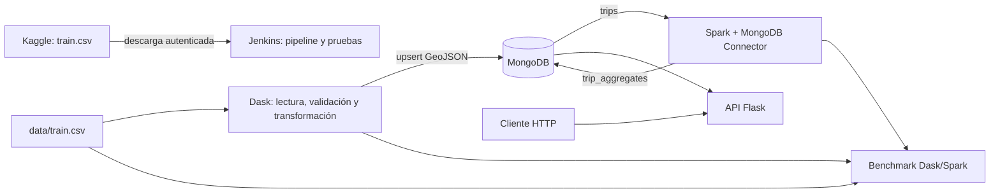

# Análisis geoespacial y temporal de trayectorias de taxis en Porto

**Proyecto académico de Big Data**  
**Fecha:** 9 de octubre de 2026

## Resumen

Este proyecto implementa un flujo reproducible para explorar y procesar trayectorias de taxis de Porto, Portugal. Los registros se limpian y transforman con Dask, se almacenan como puntos GeoJSON en MongoDB y se agregan por celda espacial y hora con Apache Spark. Una API Flask expone consultas geoespaciales de proximidad, contención y agregación. También se prepararon benchmarks de Dask y Spark y un pipeline Jenkins que obtiene el conjunto de datos desde Kaggle y ejecuta las pruebas.

En el CSV de 1.710.670 viajes se validaron 1.704.759 registros para la ingesta. Dos filas válidas idénticas se consolidan en MongoDB mediante una clave idempotente, dejando 1.704.757 documentos únicos. La agregación Spark cubrió esos documentos en 6.781 grupos; la suma de sus conteos coincide con el total cargado.

## Objetivo y alcance

El objetivo es demostrar un flujo Big Data geoespacial de extremo a extremo con herramientas distribuidas y una base documental geográfica. El alcance incluye preparación del CSV, persistencia de origen y destino, indexación espacial, agregación, API de consulta, comparación de motores y automatización inicial de CI.

## Datos

Se utiliza el dataset [Taxi Trajectory Data](https://www.kaggle.com/datasets/crailtap/taxi-trajectory), basado en la competición ECML/PKDD 2015 de predicción de duración de viajes. El archivo `train.csv` contiene más de 1,7 millones de registros (aprox. 1,94 GB). Cada polilínea codifica pares de longitud y latitud WGS84, muestreados cada 15 segundos. El tiempo de viaje se deriva como `(número de puntos - 1) × 15`.

El CSV y sus copias comprimidas no se versionan en Git. Jenkins puede descargarlos desde Kaggle si están configuradas las credenciales en Jenkins; el pipeline requiere una credencial de tipo Secret file con ID `kaggle-json`.

## Arquitectura

MongoDB, Dask, Spark y Flask se ejecutan mediante Docker Compose. Jenkins se activa con el perfil `ci`; los benchmarks se ejecutan como jobs bajo el perfil `benchmark` o mediante `spark-submit`.

## Ingesta y modelo geoespacial

Dask lee el CSV por particiones y valida campos requeridos, banderas de datos faltantes, timestamps y coordenadas. Los viajes con `MISSING_DATA=True`, polilíneas vacías o geometrías inválidas se rechazan. Para cada registro aceptado se guardan en `taxi_geospatial.trips`:

- `location`: primer punto de la trayectoria como GeoJSON Point.
- `destination`: último punto como GeoJSON Point.
- `started_at`: timestamp UTC.
- `point_count` y `trip_duration_seconds`.
- atributos de viaje anonimizados y claves de clasificación disponibles.

Se crea un índice `2dsphere` sobre `location`. El `_id` se calcula a partir de una huella SHA-256 de la fila de origen completa. Esto conserva viajes diferentes que comparten `TRIP_ID`, hace idempotentes las reejecuciones y consolida filas duplicadas idénticas.

## Agregación con Spark

El job Spark lee la colección `trips` mediante MongoDB Spark Connector. Convierte origen y hora UTC en una celda de 0,01 grados por dimensión y hora del día, y agrupa los viajes por `(grid_lon, grid_lat, hour_utc)`. Guarda `trip_count` y el centro de celda GeoJSON en `taxi_geospatial.trip_aggregates`.

La ejecución validada produjo 6.781 grupos. La suma de `trip_count` es 1.704.757, igual al número de documentos fuente. El job reemplaza solamente la colección agregada al ejecutarse de nuevo.

## Consultas geoespaciales

La API está disponible en el puerto 5000. Sus operaciones principales son:

1. **Proximidad con `$near`:** `GET /api/v1/trips/near?longitude=-8.61&latitude=41.14&radius_m=500&limit=100`. Busca viajes dentro del radio en metros y devuelve primero los más cercanos.
2. **Contención con `$geoWithin`:** `GET /api/v1/trips/within?min_lon=-8.7&min_lat=41.1&max_lon=-8.5&max_lat=41.2&limit=100`. Construye un polígono GeoJSON cerrado a partir de la caja WGS84.
3. **Agregación con `$geoNear`:** `GET /api/v1/trips/aggregate/near?longitude=-8.61&latitude=41.14&radius_m=500`. La primera etapa del pipeline calcula la distancia esférica y filtra por radio; las etapas siguientes agrupan por tipo de llamada y devuelven viajes, distancia media y duración media.
4. **Agregados dentro de área:** `GET /api/v1/aggregates/within?...` selecciona centros de celda Spark dentro de la caja indicada.

Las consultas geoespaciales aseguran la existencia del índice `2dsphere` correspondiente. Los parámetros se validan y las respuestas limitan resultados donde aplica; parámetros inválidos producen HTTP 400 y fallos MongoDB HTTP 503.

## Benchmark

Ambos jobs realizan una operación equivalente sobre el mismo CSV: extraen el origen, agrupan por celda de 0,01 grados y hora UTC y reportan duración, cantidad de viajes y grupos.

| Motor | Paralelismo | Tiempo (s) | Viajes válidos | Grupos |
|---|---:|---:|---:|---:|
| Dask | 1 worker | 136,33 | 1.704.759 | 6.781 |
| Dask | 2 workers | 81,02 | 1.704.759 | 6.781 |
| Spark | `local[1]` | 190,03 | 1.704.759 | 6.781 |
| Spark | `local[2]` | 108,19 | 1.704.759 | 6.781 |

En esta ejecución local, aumentar de uno a dos workers/slots redujo el tiempo de ambos motores. Dask fue más rápido en las configuraciones medidas; no se debe generalizar el resultado: se midió una ejecución por configuración y los tiempos dependen de hardware, caché, JVM y carga de fondo. GitHub contiene además mediciones hechas por otro integrante con distinta configuración (Dask con paralelismo 2 y Spark con 12); no son una comparación controlada entre motores.

## Automatización y pruebas

`Jenkinsfile` define checkout, descarga condicional del dataset y ejecución de pruebas. Jenkins necesita credenciales Kaggle. Para recibir eventos push, se habilitó el trigger `githubPush()` y el plugin correspondiente; GitHub debe poder alcanzar el endpoint HTTPS público `/github-webhook/`. La instancia Compose de desarrollo está enlazada a `127.0.0.1`, por lo que el webhook remoto no funcionará hasta configurar un endpoint público seguro y registrar la URL en los ajustes del repositorio. La URL real no está configurada en este documento.

La suite local incluye 16 pruebas de transformación, API, construcción de consultas y agrupación; las 16 pasaron al validar estos cambios. La prueba del pipeline `$geoNear` comprueba que sea la primera etapa, use coordenadas WGS84 y radio en metros, y agrupe por tipo de llamada.

## Limitaciones y trabajo futuro

- El benchmark mide la agregación sobre CSV local y no mide consumo de memoria ni coste de transferencia/lectura desde MongoDB.
- Las celdas se definen en grados y no tienen área métrica constante; son apropiadas para esta demostración local, no para análisis de área de alta precisión.
- La descarga automatizada y el webhook dependen de credenciales y configuración externa de Jenkins/GitHub; no se incluyen secretos ni datos grandes en Git.
- La exploración adicional puede incluir filtros temporales, comparación de áreas geográficas no rectangulares, mediciones repetidas con estadística y un despliegue Jenkins con HTTPS.

## Reproducción

Los comandos para Compose, ingesta, agregación, API y benchmark están en el [README principal](../README.md). Ejecutar `python -m pytest -q` para verificar las pruebas. Los datos locales se descargan aparte y las credenciales se configuran fuera del repositorio.
