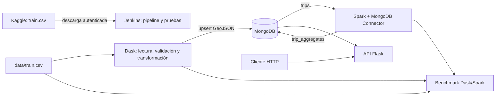

# Análisis geoespacial y temporal de trayectorias de taxis en Porto

**Proyecto académico de Big Data**  
**Fecha:** 9 de octubre de 2026

## Resumen

Este proyecto implementa un flujo reproducible para explorar y procesar trayectorias de taxis de Porto, Portugal. Los registros se limpian y transforman con Dask, se almacenan como puntos GeoJSON en MongoDB y se agregan por celda espacial y hora con Apache Spark. Una API Flask expone consultas geoespaciales de proximidad, contención y agregación. Los benchmarks comparan tiempo y pico de memoria de Dask y Spark; Jenkins obtiene el conjunto de datos, prueba la API candidata y despliega la imagen solo si las pruebas y el smoke test pasan.

En el CSV de 1.710.670 viajes se validaron 1.704.759 registros para la ingesta. Dos filas válidas idénticas se consolidan en MongoDB mediante una clave idempotente, dejando 1.704.757 documentos únicos. La agregación Spark cubrió esos documentos en 6.781 grupos; la suma de sus conteos coincide con el total cargado.

## Objetivo y alcance

El objetivo es demostrar un flujo Big Data geoespacial de extremo a extremo con herramientas distribuidas y una base documental geográfica. El alcance incluye preparación del CSV, persistencia de origen y destino, indexación espacial, agregación, API de consulta, comparación de motores y automatización inicial de CI.

## Datos

Se utiliza el dataset [Taxi Trajectory Data](https://www.kaggle.com/datasets/crailtap/taxi-trajectory), basado en la competición ECML/PKDD 2015 de predicción de duración de viajes. El archivo `train.csv` contiene más de 1,7 millones de registros (aprox. 1,94 GB). Cada polilínea codifica pares de longitud y latitud WGS84, muestreados cada 15 segundos. El tiempo de viaje se deriva como `(número de puntos - 1) × 15`.

El CSV y sus copias comprimidas no se versionan en Git. Jenkins puede descargarlos desde Kaggle si están configuradas las credenciales en Jenkins; el pipeline requiere una credencial de tipo Secret file con ID `kaggle-json`.

## Arquitectura

MongoDB, Dask, Spark y Flask se ejecutan mediante Docker Compose. Jenkins se activa con el perfil `ci`; los benchmarks se ejecutan como jobs bajo el perfil `benchmark` o mediante `spark-submit`.

## Ingesta y modelo geoespacial

Dask lee el CSV por particiones y valida campos requeridos, banderas de datos faltantes, timestamps y coordenadas. Los viajes con `MISSING_DATA=True`, polilíneas vacías o geometrías inválidas se rechazan. Para cada registro aceptado se guardan en `taxi_geospatial.trips`:

- `location`: primer punto de la trayectoria como GeoJSON Point.
- `destination`: último punto como GeoJSON Point.
- `started_at`: timestamp UTC.
- `point_count` y `trip_duration_seconds`.
- atributos de viaje anonimizados y claves de clasificación disponibles.

Se crea un índice `2dsphere` sobre `location`. El `_id` se calcula a partir de una huella SHA-256 de la fila de origen completa. Esto conserva viajes diferentes que comparten `TRIP_ID`, hace idempotentes las reejecuciones y consolida filas duplicadas idénticas.

## Agregación con Spark

El job Spark lee la colección `trips` mediante MongoDB Spark Connector. Convierte origen y hora UTC en una celda de 0,01 grados por dimensión y hora del día, y agrupa los viajes por `(grid_lon, grid_lat, hour_utc)`. Guarda `trip_count` y el centro de celda GeoJSON en `taxi_geospatial.trip_aggregates`.

La ejecución validada produjo 6.781 grupos. La suma de `trip_count` es 1.704.757, igual al número de documentos fuente. El job reemplaza solamente la colección agregada al ejecutarse de nuevo.

## Consultas geoespaciales

La API está disponible en el puerto 5000. Sus operaciones principales son:

1. **Proximidad con `$near`:** `GET /api/v1/trips/near?longitude=-8.61&latitude=41.14&radius_m=500&limit=100`. Busca viajes dentro del radio en metros y devuelve primero los más cercanos.
2. **Contención con `$geoWithin`:** `GET /api/v1/trips/within?min_lon=-8.7&min_lat=41.1&max_lon=-8.5&max_lat=41.2&limit=100`. Construye un polígono GeoJSON cerrado a partir de la caja WGS84.
3. **Agregación con `$geoNear`:** `GET /api/v1/trips/aggregate/near?longitude=-8.61&latitude=41.14&radius_m=500`. La primera etapa del pipeline calcula la distancia esférica y filtra por radio; las etapas siguientes agrupan por tipo de llamada y devuelven viajes, distancia media y duración media.
4. **Agregados dentro de área:** `GET /api/v1/aggregates/within?...` selecciona centros de celda Spark dentro de la caja indicada.

Las consultas geoespaciales aseguran la existencia del índice `2dsphere` correspondiente. Los parámetros se validan y las respuestas limitan resultados donde aplica; parámetros inválidos producen HTTP 400 y fallos MongoDB HTTP 503.

## Benchmark

Ambos jobs realizan una operación equivalente sobre el mismo CSV: extraen el origen, agrupan por celda de 0,01 grados y hora UTC y reportan duración, cantidad de viajes y grupos.

| Motor | Paralelismo | Tiempo (s) | Pico memoria (MiB) | Viajes válidos | Grupos |
|---|---:|---:|---:|---:|---:|
| Dask | 1 worker | 83,90 | 668,44 | 1.704.759 | 6.781 |
| Dask | 2 workers | 39,75 | 765,50 | 1.704.759 | 6.781 |
| Spark | `local[1]` | 124,41 | 870,54 | 1.704.759 | 6.781 |
| Spark | `local[2]` | 70,05 | 716,17 | 1.704.759 | 6.781 |

El pico de memoria se obtiene de `memory.peak` (cgroup v2) o `memory.max_usage_in_bytes` (cgroup v1) de cada contenedor efímero, e incluye JVM/workers y su inicialización. La medición depende del límite y soporte de cgroups del entorno Docker. Dask fue más rápido que Spark en las dos configuraciones: 83,90 frente a 124,41 s con paralelismo 1 y 39,75 frente a 70,05 s con paralelismo 2. Su pico fue menor con paralelismo 1 (668,44 frente a 870,54 MiB) y ligeramente mayor con paralelismo 2 (765,50 frente a 716,17 MiB). Aumentar paralelismo redujo el tiempo en ambos; el pico subió en Dask y bajó en Spark, lo cual puede depender del heap, GC y variabilidad de una sola corrida. Para esta agregación Dask fue más rápido; Spark resulta conveniente para el procesamiento distribuido ya conectado a MongoDB. No se debe generalizar: se midió una ejecución por configuración y los resultados dependen de hardware, caché, JVM y carga de fondo. GitHub contiene además mediciones hechas por otro integrante con distinta configuración (Dask con paralelismo 2 y Spark con 12); no son una comparación controlada entre motores.

## Automatización y pruebas

`Jenkinsfile` define checkout, descarga condicional del dataset, pytest, build de la imagen API, despliegue temporal de una candidata y solicitud a `/health`. Si el smoke test responde con `{"status":"ok"}`, Jenkins actualiza el servicio `api`; en caso contrario, elimina la candidata y no despliega la versión nueva. Jenkins comparte la red y el proyecto Compose existente (`parcial` por defecto), por lo que el parámetro `COMPOSE_PROJECT_NAME` debe coincidir con el proyecto local. La imagen Jenkins incluye Docker CLI/Compose y monta `/var/run/docker.sock`; este socket concede control prácticamente administrativo al daemon y se reserva para el equipo local de desarrollo. Para recibir eventos push, se habilitó y probó el trigger `githubPush()` mediante el webhook HTTPS público `/github-webhook/`; la URL del túnel es temporal y debe mantenerse activa durante la demostración.

La suite incluye pruebas de transformación, API, construcción de consultas, agrupación y lectura de la métrica cgroup. Debe ejecutarse antes de construir y desplegar; el pipeline también valida `/health` contra una API candidata en Docker.

## Limitaciones y trabajo futuro

- El benchmark mide la agregación sobre CSV local; el pico cgroup representa el contenedor completo, no el RSS aislado de cada proceso, y depende del soporte de memoria cgroup de Docker.
- Las celdas se definen en grados y no tienen área métrica constante; son apropiadas para esta demostración local, no para análisis de área de alta precisión.
- La descarga automatizada y el webhook dependen de credenciales y configuración externa de Jenkins/GitHub; no se incluyen secretos ni datos grandes en Git. El despliegue desde Jenkins requiere el socket Docker y no debe habilitarse para código no confiable.
- Las mediciones reportadas corresponden a una ejecución por configuración; repetirlas y calcular estadísticos permitiría conclusiones más robustas.

## Reproducción

Los comandos para Compose, ingesta, agregación, API y benchmark están en el [README principal](../README.md). Ejecutar `python -m pytest -q` para verificar las pruebas. Los datos locales se descargan aparte y las credenciales se configuran fuera del repositorio.
